<!-- Generated by scripts/render_mathematics.py from docs/MATHEMATICS_SOURCE.md. -->
# Математика и алгоритм Active Block Wishart TPP

## 1. Архитектурная граница

Active Block Wishart — вероятностная и обучающая обёртка над произвольным
нейросетевым TPP. Единственное требование к backbone — выдать банк
положительных интенсивностей

Ни Wishart decoder, ни variational inference не зависят от внутреннего
состояния backbone. В коде граница представлена `IntensityBank -> TPPTrace`.

Поддержанные adapters:

- COTIC: continuous convolution;
- THP: Transformer Hawkes Process;
- NHP: continuous-time LSTM;
- RMTPP: recurrent marked TPP.

Последние три используют нейросетевые блоки EasyTPP 0.2.1.

## 2. Генеративная модель

Для каждой траектории :

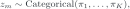

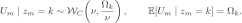

Для устранения скалярной неоднозначности используется ограничение

Определим Wishart-преобразование базовой интенсивности

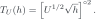

Условная интенсивность траектории:

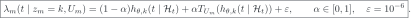

Корень и квадрат внутри  берутся покоординатно,  — главный
симметричный матричный корень. Интерполяция выполняется после преобразования,
в пространстве интенсивностей. Одна и та же формула с тем же 
используется в событийном члене и компенсаторе.

Это active-block конструкция: при гипотезе  локальная
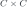 матрица действует только на -й выходной блок. Размер
random effect не растёт с числом кластеров.

### Pure/no-W endpoint

При :

Латентная матрица исчезает из likelihood, и модель точно совпадает с обычной
смесью выбранного backbone. Это вложенность модели, а не приблизительная
абляция.

## 3. Обычный marked-TPP likelihood

Для последовательности

компонентный log likelihood равен

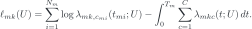

В реализации интегратор выбирается независимо от backbone. Контрольный режим
использует Gauss--Legendre quadrature, а Monte Carlo режим сэмплирует на каждом
межсобытийном интервале 

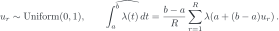

Эта оценка несмещённая. Во время neural training точки пересэмплируются;
validation и test используют фиксированные common random numbers, чтобы шум
интеграла не влиял на выбор checkpoint и парное сравнение методов.
`TPPTrace` хранит:

где  и  — точки и веса выбранного интегратора. После
построения trace локальный VI больше не вызывает backbone.

## 4. Вариационное семейство

Для каждой пары «траектория--компонента»:

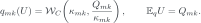

Локальная free energy:

Responsibilities:

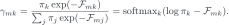

Полный ELBO:

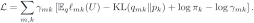

### Параметризация local posterior

 параметризуется Cholesky factor:

Degrees of freedom:

что гарантирует существование Wishart law. Градиенты проходят через
Bartlett decomposition; для диагональных gamma variables используется
pathwise реализация PyTorch.

## 5. KL между Wishart laws

Для

используется аналитический KL. Его 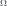-зависимая часть:

с точностью до множителей и констант, не зависящих от .

Тест отдельно проверяет

## 6. Exact population M-step для Omega

При фиксированных  и  sufficient mean компоненты:

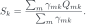

Population M-step решает

Оптимум коммутирует с 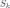. Пусть  и  — их
соответствующие собственные значения. KKT condition:

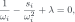

то есть

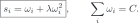

При  выбирается малая положительная ветвь quadratic root.
При  стационарная система может содержать одну большую ветвь;
solver перебирает допустимые branch configurations и выбирает кандидата с
минимальным objective. После решения eigenvalues ограничиваются снизу
 и повторно нормируются по trace для устойчивости float32.

Поэтому update

не используется: он сохраняет trace, но в общем случае не решает указанную
constrained задачу.

## 7. M-step для pi и alpha

Mixture weights имеют обычное closed-form обновление:

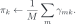

Для  фиксируются draws

и минимизируется common-random-number Monte Carlo objective

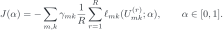

Это одномерный bounded golden-section search. Обе границы  и ,
а также предыдущее значение , всегда оцениваются явно.

## 8. Neural M-step

При фиксированных  backbone максимизирует

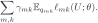

Локальные draws и responsibilities отсоединены от autograd; градиент идёт
только в параметры intensity bank. `mixture_logits` исключены из Adam,
поскольку  уже получила отдельное closed-form обновление.

Lightning Fabric выполняет только:

- device/precision setup;
- backward;
- gradient clipping.

Цикл оптимизации остаётся обычным Python-кодом без LightningModule,
callbacks и скрытых optimizer hooks.

## 9. Базовый all-12 алгоритм

Pure и Wishart запускаются независимо. При одинаковых config и seed каждый
запуск воспроизводит один и тот же K-компонентный checkpoint после 10
minibatch-шагов. Далее neural budget одинаков:

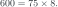

Один Wishart outer cycle:

1. Заморозить backbone и построить train trace cache.
2. Выполнить 10 Adam-шагов local VI с двумя Wishart draws.
3. Посчитать ; первые 6 циклов применить Sinkhorn-like balancing.
4. Полностью заменить  exact trace-constrained optimum.
5. Обновить  средними responsibilities.
6. Если  не зафиксирована конфигурацией, найти её 25 итерациями
   bounded search, используя 4 draws.
7. Выполнить 8 neural M-steps с одним persistent Adam.
8. Оценить validation prior-predictive NLL с 64 prior draws.
9. Сохранить checkpoint, если validation NLL улучшился.

В базовом режиме нет damping, alpha trust region и повторного E-step после
изменения . Эти варианты могут добавляться дальше как отдельные
schedule-абляции относительно общей исходной точки.

## 10. Prior и posterior predictive

Для новой траектории:

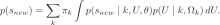

Validation checkpoint выбирается только по Monte Carlo оценке этого
prior-predictive likelihood. Локальный posterior validation/test траектории
не используется для выбора модели.

После выбора checkpoint можно оценить

и posterior responsibilities. Это отдельная задача персонализации и
кластеризации, а не prior-predictive test score.

## 11. Что идентифицируется

Наблюдаемой является композиция

а не отдельная координатная запись . Backbone способен менять
базовый банк, а  частично обменивается с функциональным отклонением
. Поэтому raw Frobenius error  является вторичной
диагностикой.

Основные функциональные критерии:

- prior-predictive NLL gain относительно Pure;
- posterior/prefix-to-suffix prediction;
- ошибка восстановленной интенсивности;
- count и mark prediction;
- ARI и purity;
- устойчивость при разбиении контекста при общем trajectory-level 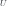.

Wishart здесь следует интерпретировать как контролируемое стохастическое
расширение пространства функций интенсивности с persistent SPD random
effect. Физическое совпадение конкретной  не требуется для
функциональной корректности модели.

## 12. DAN protocol

Для каждого набора используется независимый deterministic split:

созданный `numpy.random.RandomState(42).shuffle`. Validation выбирает
checkpoint. Test используется один раз после выбора. Pure и Wishart получают:

- одинаковый split;
- одинаковую инициализацию;
- один shared short checkpoint;
- одинаковое число neural updates;
- одинаковый backbone adapter.

Один train-запуск оптимизирует только один метод. Дополнительного Pure EM
trainer нет: EM-подобная endpoint-абляция использует обычный Wishart schedule
с фиксированной .
